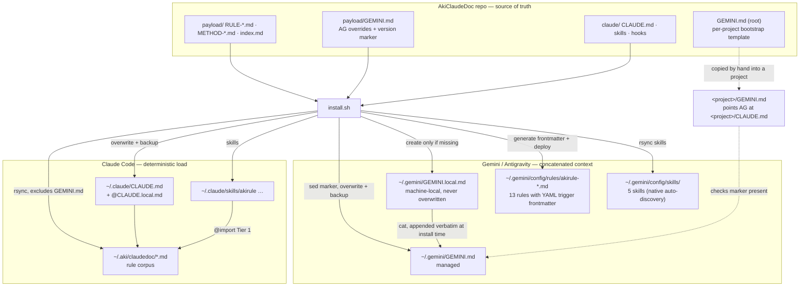
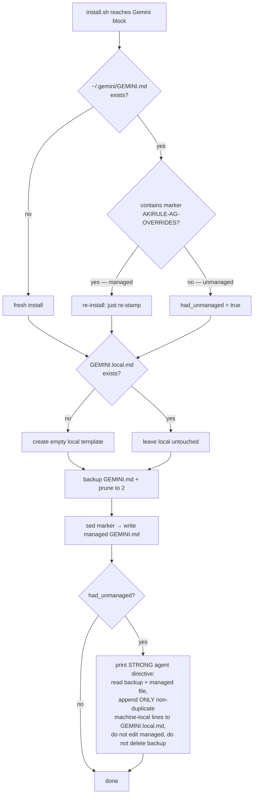

# Architecture — how rules reach the two agents

AkiClaudeDoc is the single source of truth for a reusable rule baseline. That baseline has to reach two different agents that load context in fundamentally different ways: **Claude Code** and **Gemini / Antigravity**. This document describes how one source is installed onto a machine and consumed by each.

## The core asymmetry

| | Claude Code | Gemini / Antigravity |
|---|---|---|
| How rule files reach the model | Harness-guaranteed `@`-imports via the `akirule` skill | Context files concatenated and prepended to every prompt |
| Determinism | **Deterministic** — 0 model-dependent hops; the content is in-context whether or not the model "decides" to read it | **Deterministic for the files it auto-loads**, but any "please read file X" pointer inside them is a soft hop the model may skip |
| Consequence | Rule *content* always arrives | Rule *content* arrives only if it sits in a file the tool hard-loads — not behind a chain of pointers |

**Design conclusion:** behavior rules that Gemini/Antigravity must always obey cannot live behind a soft pointer chain. They are placed in the one file the tool hard-loads globally — `~/.gemini/GEMINI.md` — as literal content, not as a link to go fetch.

## What the source provides

```text
AkiClaudeDoc/
  payload/
    index.md, RULE-*.md, METHOD-*.md   → the rule corpus (Claude Code consumes this)
    GEMINI.md                          → Gemini/Antigravity global behavior overrides (NOT a rule file)
  claude/
    CLAUDE.md, skills/, hooks/         → Claude Code runtime assets
  GEMINI.md (repo root)                → per-project bootstrap template (copied into a project by hand)
  install.sh                           → installs all of the above onto a machine
```

Two distinct `GEMINI.md` files, different jobs:

- **`payload/GEMINI.md`** — the **global behavior overrides**. Installed to `~/.gemini/GEMINI.md`. Line 1 carries a version marker `# [AKIRULE-AG-OVERRIDES-<version>]`. Ends with `@~/.gemini/GEMINI.local.md` to pull in machine-local facts.
- **`GEMINI.md` at repo root** — a tiny **per-project bootstrap**. Copied into an individual project so Antigravity, on opening that project, is pointed at the project's `CLAUDE.md` as its source of truth. It also checks whether the global override marker is present. It is **not** distributed by `install.sh`.

## Rule delivery — source to consumers



## The managed / local split (both agents, same pattern)

Each agent gets a **managed** file the installer owns and overwrites, plus a **`.local.md`** sibling the installer creates once and never touches again:

| Managed (overwritten each install) | Machine-local (created once, never overwritten) |
|---|---|
| `~/.claude/CLAUDE.md` | `~/.claude/CLAUDE.local.md` |
| `~/.gemini/GEMINI.md` | `~/.gemini/GEMINI.local.md` |

The two agents join the local file differently, and the difference is deliberate:

- **Claude Code** — the managed file ends with `@~/.claude/CLAUDE.local.md`. The harness resolves the import itself, so this is a hard load, not a pointer the model may skip.
- **Gemini / Antigravity** — `install.sh` **appends `GEMINI.local.md` verbatim** (`cat …local >> …managed`) at install time. The text is physically present in the managed file; there is no import to honor and therefore nothing to verify per environment.

Either way, per-machine facts (local paths, CLIs, emulator commands) survive every reinstall while shared rules stay centrally managed and overwrite-safe.

> **Note (2026-07-22):** an earlier revision of this document described the Gemini side as an `@import` too, and flagged "does the Antigravity IDE honor imports?" as an open risk. That risk was never real — the installer has always concatenated. Corrected here so the mermaid, the prose, and `install.sh` finally agree.

## install.sh — Gemini handling and the two run scenarios

`install.sh` is usually run by an **AI agent**, occasionally by a human. The installer does only mechanical work; anything requiring **semantic judgement** is delegated to the agent via an explicit printed directive, because shell cannot reliably tell a machine-local fact from a behavior rule.

The key case is a pre-existing **unmanaged** `~/.gemini/GEMINI.md` (hand-written, or created by Antigravity's "+ Global"). The installer never parses it — there is no universal way to know where an arbitrary user's machine-local section begins, so it must not guess by heading name. It backs the file up, installs the managed template, then prints a strong directive telling the running agent to migrate only the **non-duplicate** machine-local lines into `GEMINI.local.md`.



**Why append-only + backup-preserved:** the migration the agent performs is safe and reversible — it only appends to a local file, and the full original remains in the timestamped backup. That is why the directive tells the agent to proceed without a confirmation round-trip.

## Version marker

The marker on line 1 of `~/.gemini/GEMINI.md` (`V<date>[-<git-hash>]`) is a **presence + freshness fingerprint**, not a content hash. Two uses:

1. **Idempotency** — a second install sees the marker and knows the file is already managed (no unmanaged-migration directive fires).
2. **Per-project detection** — a project's bootstrap `GEMINI.md` can check whether the overrides are present in context at all.

If the source working tree is dirty at install time, the git-hash portion still points at the last commit; the marker is a fingerprint for "are the overrides present and roughly which version", not a guarantee of exact content.

## Invariants (do not regress)

- The installer never encodes any one machine's specifics (paths, section names) into shared logic. Machine-specific migration is delegated to the running agent, not hard-coded.
- `payload/GEMINI.md` is excluded from the rule-corpus rsync; it is the source for `~/.gemini/GEMINI.md` only.
- `*.local.md` files are created only when missing and are never overwritten.
- Managed files are always backed up (timestamped, pruned to the 2 most recent) before overwrite.

## Verified behavior (2026-07-23)

- **`trigger: glob` rules do not appear in initial context dumps.** This is by design — AG holds them on disk and injects them only when the user interacts with files matching the glob pattern. A "list your context" test will never show glob rules; the correct test is to open a matching file and check if the rule appears.
- **`skills.json` tilde paths (`~/...`) are not expanded by AG's JSON parser.** The installer registers both the absolute path and the tilde path. Primary delivery is via direct rsync to `~/.gemini/config/skills/` (native auto-discovery, no `skills.json` needed).
- **YAML frontmatter in SKILL.md must have each key on its own physical line.** `name: x description: y` on one line causes AG to silently skip the skill.
- **Cross-platform verification (2026-07-23):** 5/5 skills and 13/13 rules confirmed across AG IDE (Mac), AGY CLI (Linux), Claude Code (Mac), Claude Code (Linux).
